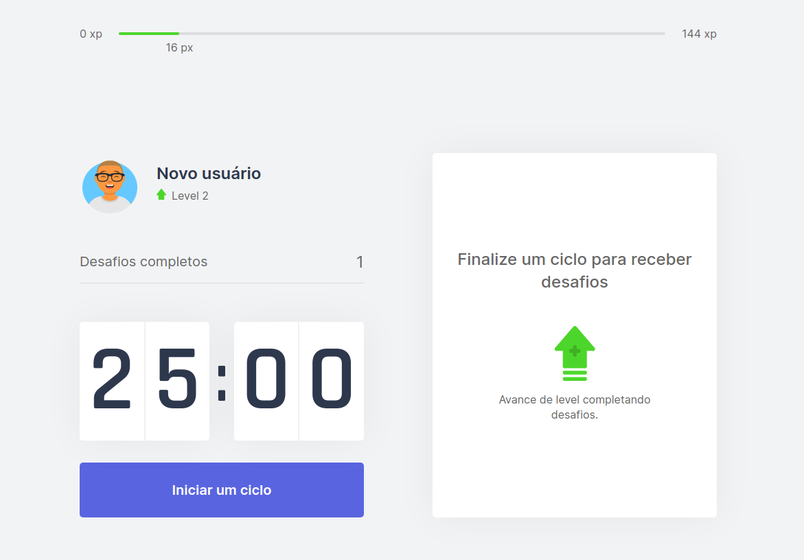

<h1 align="center">
    
</h1>

<h4 align="center">
	🚀 Move it
</h4>

<p align="center">
  

  

  <a href="https://www.linkedin.com/in/pablo-melo-377297161/">
    
  </a>

  <a href="https://github.com/PabloMelo11/Moveit/commits/master">
    
  </a>

  <a href="https://github.com/PabloMelo11/Moveit/issues">
    
  </a>

  
</p>

## 💻 Project

Application developed in the fourth edition of Next level week

<<<<<<< HEAD
Link application: https://nlw-moveit-pi.vercel.app/

=======
>>>>>>> b48aa13121c5e4205356b8b0f0ac431e3461e471
<h1 align="center">
    
</h1>

## 🚀 Technologies

This project was developed with the following technologies:

- [React](https://pt-br.reactjs.org/)
- [Next](https://nextjs.org/)
- [Context API](https://pt-br.reactjs.org/docs/context.html)
- [Typescript](https://www.typescriptlang.org/)

## 🔥️ Functional requirements

- The user can start a cycle
- After the cycle is over, the user performs a challenge
- The user can increase his XP when completing challenges
- User can level up by completing challenges

## 🤔 Get Started

- Clone the repository:

```sh
  $ git clone https://github.com/PabloMelo11/Moveit.git
```

After that, run the command below to install the dependencies:

```sh
  $ yarn # or npm install
```

Start the application by running the command:

```sh
  $ yarn dev
```

Made with ♥ by Pablo Melo :wave: [Get in touch!](https://www.linkedin.com/in/pablo-melo-377297161/)
